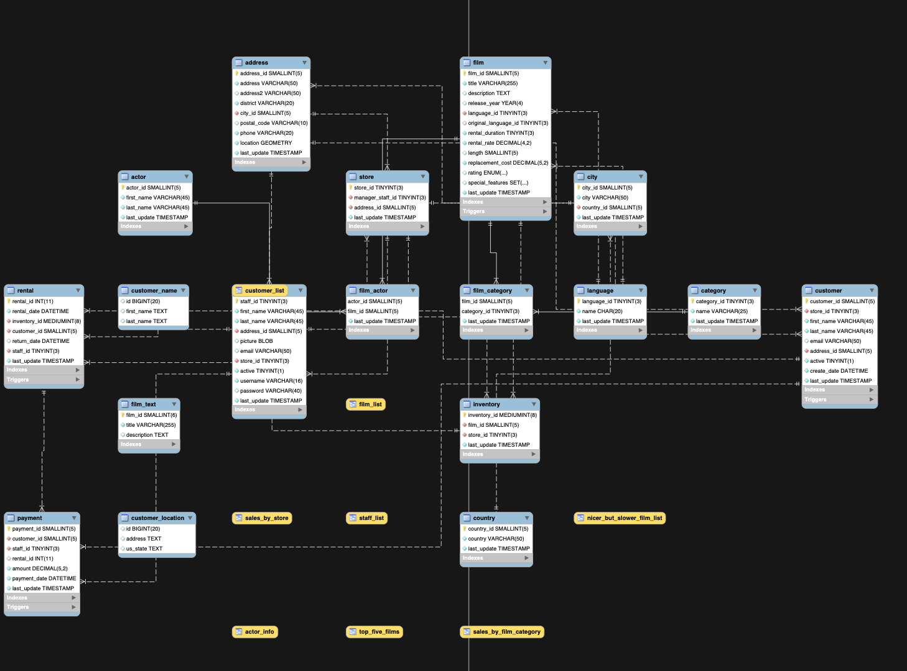

# SAKILA SQL
These SQL queries utilize the Sakila demo database that deals with multiple interrelated tables dealing with movies, actors, video rentals, times, dates, customer data, actor data, addresses, movie descriptions etc....
Sakila is a great database to understand relationships between tables, database keys and queries overall in a multifaceted business context.

